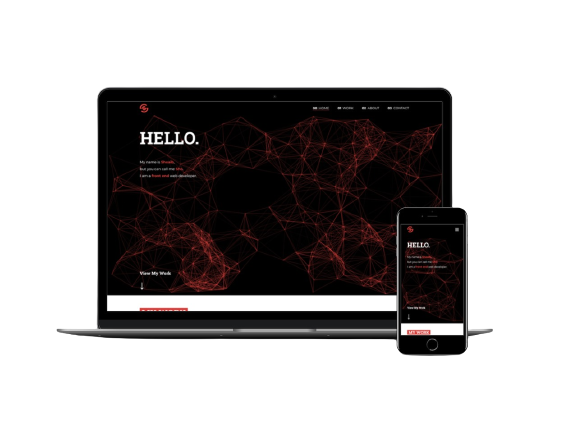

<h2 align="center">Personal Portfolio -
  <a href="https://www.shoshaikh.com/" target="_blank">shoshaikh.com</a>
</h2>

  

I created my personal portfolio <a href="https://www.shoshaikh.com/" target="_blank">shoshaikh.com</a> to showcase some of my projects I've worked on in the past, as well as to show some of my technical skills. 
 
My portfolio was built using only using HTML, CSS, and Vanilla JS. This was also my first time learning how to use HTML Canvas, and adding animations using only Vanilla JS.
